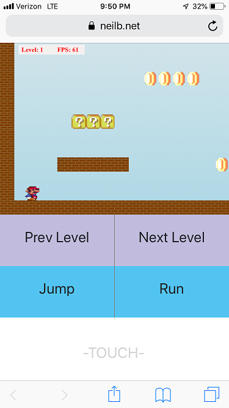

# Mario HTML
View demo here

https://www.neilb.net/MarioHTML/

To Build the project first install TypeScript and the dependencies

`npm install -g typescript`

`npm install`

Then run the TSC Compiler to build the JavaScript Files

`tsc`

Also supports mobile and Xbox One Controller on PC

